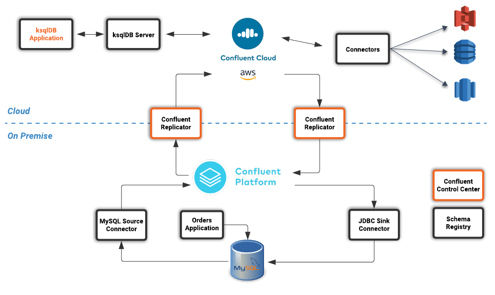

# Demo: Confluent + AWS - Digital Integration Hub
This is a joint demo to showcase the power of Confluent and MongoDB together.

You can watch a recording of the joint webinar including the demo here: [Stream me to the Cloud (and back) with Confluent & MongoDB](https://www.mongodb.com/presentations/stream-me-to-the-cloud-and-back)

In this demo we'll use:
1. Confluent Platform
1. Confluent Cloud
1. Confluent Replicator
1. AWS





## Configure Cloud Provider

### Configure AWS

1. You will need AWS API key and secret


## Configure the demo
1. Clone this repository, from now on we'll consider this as base path
1. create a copy of the file `config/demo.cfg.example` and rename the copy `demo.cfg`
1. fill the `demo.cfg` file with the required information


## Spin Up the Demo

### Pre-requisites
For this approach you need the following installed in your computer.

1. Install Terraform:
   - for MacOs -> `brew install terraform`
   - Alternatively see [Installation Instructions](https://learn.hashicorp.com/terraform/getting-started/install.html)
1. Install Confluent Cloud CLI:
   - for MacOs -> `curl -L https://cnfl.io/ccloud-cli | sh -s -- -b /<path-to-directory>/bin`i.e./usr/local/bin
   - Alternatively see [Installation Instructions](https://docs.confluent.io/current/cloud/cli/install.html)
1. Python + [Yaml](https://pyyaml.org/wiki/PyYAML)
1. Install Mac coreutils:
   - for MacOs -> `brew install coreutils`

### Create the demo environment

1. execute `./create_demo_environment.sh`
1. The script will prompt you to confirm twice.
    - The first time it will ask you if you are ok to create resources in Confluent Cloud, you must answer YES
    - The first time it will ask you if you want to create a ksqlDB instance. This is not required for this demo as it will be provisioned in the VM. You can answer NO .
1. At the end of the script you will receive an output with the IP of your demo. Copy that ip in your browser to continue

## Demo Walkthrough
At the end of the script you should receive an uotput that looks like this:

```bash
Apply complete! Resources: 1 added, 0 changed, 1 destroyed.
                                                                                       
██████╗ ██╗ ██████╗ ██╗████████╗ █████╗ ██╗                                            
██╔══██╗██║██╔════╝ ██║╚══██╔══╝██╔══██╗██║                                            
██║  ██║██║██║  ███╗██║   ██║   ███████║██║                                            
██║  ██║██║██║   ██║██║   ██║   ██╔══██║██║                                            
██████╔╝██║╚██████╔╝██║   ██║   ██║  ██║███████╗                                       
╚═════╝ ╚═╝ ╚═════╝ ╚═╝   ╚═╝   ╚═╝  ╚═╝╚══════╝                                       
                                                                                       
██╗███╗   ██╗████████╗███████╗ ██████╗ ██████╗  █████╗ ████████╗██╗ ██████╗ ███╗   ██╗ 
██║████╗  ██║╚══██╔══╝██╔════╝██╔════╝ ██╔══██╗██╔══██╗╚══██╔══╝██║██╔═══██╗████╗  ██║ 
██║██╔██╗ ██║   ██║   █████╗  ██║  ███╗██████╔╝███████║   ██║   ██║██║   ██║██╔██╗ ██║ 
██║██║╚██╗██║   ██║   ██╔══╝  ██║   ██║██╔══██╗██╔══██║   ██║   ██║██║   ██║██║╚██╗██║ 
██║██║ ╚████║   ██║   ███████╗╚██████╔╝██║  ██║██║  ██║   ██║   ██║╚██████╔╝██║ ╚████║ 
╚═╝╚═╝  ╚═══╝   ╚═╝   ╚══════╝ ╚═════╝ ╚═╝  ╚═╝╚═╝  ╚═╝   ╚═╝   ╚═╝ ╚═════╝ ╚═╝  ╚═══╝ 
                                                                                       
██╗  ██╗██╗   ██╗██████╗                                                               
██║  ██║██║   ██║██╔══██╗                                                              
███████║██║   ██║██████╔╝                                                              
██╔══██║██║   ██║██╔══██╗                                                              
██║  ██║╚██████╔╝██████╔╝                                                              
╚═╝  ╚═╝ ╚═════╝ ╚═════╝                                                               
                                                                                       
 ██████╗ ██████╗ ███╗   ██╗███████╗██╗     ██╗   ██╗███████╗███╗   ██╗████████╗        
██╔════╝██╔═══██╗████╗  ██║██╔════╝██║     ██║   ██║██╔════╝████╗  ██║╚══██╔══╝        
██║     ██║   ██║██╔██╗ ██║█████╗  ██║     ██║   ██║█████╗  ██╔██╗ ██║   ██║           
██║     ██║   ██║██║╚██╗██║██╔══╝  ██║     ██║   ██║██╔══╝  ██║╚██╗██║   ██║           
╚██████╗╚██████╔╝██║ ╚████║██║     ███████╗╚██████╔╝███████╗██║ ╚████║   ██║           
 ╚═════╝ ╚═════╝ ╚═╝  ╚═══╝╚═╝     ╚══════╝ ╚═════╝ ╚══════╝╚═╝  ╚═══╝   ╚═╝           
                                                                                       
 █████╗ ██╗    ██╗███████╗                                                             
██╔══██╗██║    ██║██╔════╝                                                             
███████║██║ █╗ ██║███████╗                                                             
██╔══██║██║███╗██║╚════██║                                                             
██║  ██║╚███╔███╔╝███████║                                                             
╚═╝  ╚═╝ ╚══╝╚══╝ ╚══════╝                                                             
                                                                                       
 ██████╗ ██╗   ██╗ █████╗ ███╗   ██╗████████╗██╗   ██╗ ██████╗ █████╗                  
██╔═══██╗██║   ██║██╔══██╗████╗  ██║╚══██╔══╝╚██╗ ██╔╝██╔════╝██╔══██╗                 
██║   ██║██║   ██║███████║██╔██╗ ██║   ██║    ╚████╔╝ ██║     ███████║                 
██║▄▄ ██║██║   ██║██╔══██║██║╚██╗██║   ██║     ╚██╔╝  ██║     ██╔══██║                 
╚██████╔╝╚██████╔╝██║  ██║██║ ╚████║   ██║      ██║   ╚██████╗██║  ██║                 
 ╚══▀▀═╝  ╚═════╝ ╚═╝  ╚═╝╚═╝  ╚═══╝   ╚═╝      ╚═╝    ╚═════╝╚═╝  ╚═╝                 
                                                                                       
                                                                                       
***************************************************************************************
 
 
Handy links: 
 - External IP: XX.133.YY.65 
 - Confluent Control Center: http://XX.133.YY.65:9021
```

### Introduction

Your environment represents an on-premise data center and consists of a virtual machine hosted in the cloud running several docker containers. In a real world implementation, some of the components would be deployed differently but the logical data flow that we will be working on would remain the same.

The primary data source for this workshop is a MySQL database running in your data center (VM). Connected to this database is a orders application. This application will continuously create new sales orders to simulate product demand. The application will also raise purchase orders when told to do so.


### View Messages in Confluent Control Center

We can use Confluent Control Center (use the link returned by the demo creation script) to monitor and control our whole demo environment. 

Use the following username and password to authenticate to Confluent Control Center

```
Username: dc01
Password: your workshop password
```


On the landing page we can see that Confluent Control Center is monitoring two Kafka Clusters, our on-premise cluster and a Confluent Cloud Cluster


Click on the "controlcenter.cluster" tile, this is your on-premise cluster.


Select the Topics Menu on the left


Select the `dc01_sales_order_details` topic


Finally select the Messages tab and observe that messages are being streamed into Kafka from MySQL in real time.


### Confluent Replicator

This Demo uses Confluent Replicator to stream the messages created by Debezium connector to Confluent Cloud.

Confluent Replicator uses Kafka Connect under the covers and can be considered a special type of connector, however, unlike other connectors, the source _and_ target technology for the connector is a Kafka Cluster.

We can view the status of Replicator in Confluent Control Center by selecting `Replicators` on the left-hand navigation pane. Here we can see throughput and latency statistics.


### Confirm that Messages are Arriving in Confluent Cloud

In Control Center you can always reach back the home by clicking on the confluent logo on the top left, or by clicking ont the HOME in the top navigation bar.
Select the "ccloud" cluster and then select "Topics". 

You can filter the list of topics by using the search box, type your data center name, dc01, into the search box at the top to filter.


Select the `dc01_sales_order_details` topic and finally the "Messages" tab under the topic heading. You should see messages streaming in from your on-premise Kafka cluster.


### ksqlDB Application

We now have all the data we need being streamed, in realtime, to Confluent Cloud. You have a ksqlDB Server. You can find it in Control Center, ccloud cluster, click on ksqlDB on the left menu.
Now click on the Flow Tab, you will see the topology of the ksqlDB application. Spend some time in understanding how the data is transformed, and see the data flowing in and being enriched in real time.


## Deep Dive

### Connecting to your virtual Data Center (VM)
To login to your virtual data center open a terminal session and use the password that you configured. Replace <External IP> with the value returned by the creation script

```
ssh dc01@<External IP>
```

Once logged in run the following command to confirm that you have several docker containers running

```bash
docker ps --format "table {{.ID}}\t{{.Names}}\t{{.RunningFor}}\t{{.Status}}"
```

You should see something similar to this.

```
CONTAINER ID        NAMES                     CREATED             STATUS
ef959fb9e566        db-trans-simulator        3 minutes ago       Up 3 minutes
979c20e26e60        ksqldb-cli                3 minutes ago       Up 3 minutes
0d9e1fa2c83f        ksqldb-server-ccloud      3 minutes ago       Up 3 minutes
4eb1ba589357        control-center            3 minutes ago       Up 3 minutes
e83088712e60        kafka-connect-ccloud      3 minutes ago       Up 3 minutes
c2362c0fc8e0        kafka-connect-onprem      3 minutes ago       Up 3 minutes
82086be4e239        schema-registry           3 minutes ago       Up 3 minutes
62b037976674        broker                    3 minutes ago       Up 3 minutes
92c955b221f3        zookeeper                 3 minutes ago       Up 3 minutes
0794f9008bb6        mysql                     3 minutes ago       Up 3 minutes (healthy)
31c3c1372aa1        workshop-docs-webserver   3 minutes ago       Up 3 minutes
```

### Inspecting the Database Schema

The MySQL database contains a simple schema that includes _Customer_, _Supplier_, _Product_, _Sales Order_ and _Purchase Order_ information. 

The idea behind this schema is simple, customers order products from a company and sales orders get created, the company then sends purchase orders to their suppliers so that product demand can be met by maintaining sensible stock levels.


We can inspect this schema further by logging into the MySQL CLI...

```
docker exec -it mysql bash -c 'mysql -u root -p$MYSQL_ROOT_PASSWORD --database orders'
```

...and viewing your tables

```
show tables;
```

There's an extra table here called `dc01_out_of_stock_events` that not in the schema diagram above, we'll cover this table separately later on.

```
+--------------------------+
| Tables_in_orders         |
+--------------------------+
| customers                |
| dc01_out_of_stock_events |
| products                 |
| purchase_order_details   |
| purchase_orders          |
| sales_order_details      |
| sales_orders             |
| suppliers                |
+--------------------------+
8 rows in set (0.00 sec)
```

Let's view the row count for each table

```
SELECT * from (
  SELECT 'customers' as table_name, COUNT(*) FROM customers 
  UNION 
  SELECT 'products' as table_name, COUNT(*) FROM products 
  UNION 
  SELECT 'suppliers' as table_name, COUNT(*) FROM suppliers 
  UNION 
  SELECT 'sales_orders' as table_name, COUNT(*) FROM sales_orders 
  UNION 
  SELECT 'sales_order_details' as table_name, COUNT(*) FROM sales_order_details 
  UNION 
  SELECT 'purchase_orders' as table_name, COUNT(*) FROM purchase_orders 
  UNION 
  SELECT 'purchase_order_details' as table_name, COUNT(*) FROM purchase_order_details 
) row_counts;
```

As you can see, we have 30 customers, suppliers and products. The count for sales orders and  purchase order will increase over time. 

```
+------------------------+----------+
| table_name             | COUNT(*) |
+------------------------+----------+
| customers              |       30 |
| products               |       30 |
| suppliers              |       30 |
| sales_orders           |      150 |
| sales_order_details    |      150 |
| purchase_orders        |       14 |
| purchase_order_details |       30 |
+------------------------+----------+
7 rows in set (0.00 sec)
```


```
SELECT * FROM purchase_order_details LIMIT 5;
```

```
+----+-------------------+------------+----------+------+
| id | purchase_order_id | product_id | quantity | cost |
+----+-------------------+------------+----------+------+
|  1 |                 1 |          1 |      100 | 6.82 |
|  2 |                 1 |          2 |      100 | 7.52 |
|  3 |                 1 |          3 |      100 | 6.16 |
|  4 |                 1 |          4 |      100 | 8.07 |
|  5 |                 1 |          5 |      100 | 2.10 |
+----+-------------------+------------+----------+------+
5 rows in set (0.00 sec)
```

Type `exit` to leave the MySQL CLI

### Debezium MySQL Source connector

In order to stream the changes happening in your MySQL database into your on-premise Kafka cluster we are using the link:https://debezium.io/documentation/reference/1.0/connectors/mysql.html[Debezium MySQL Source connector , window=_blank]

We have a Kafka Connect worker up and running in a docker container called `kafka-connect-onprem`. This Kafka Connect worker is configured to connect to your on-premise Kafka cluster and has a internal REST server listening on port `18083`. We created a connector from the command line using the cURL command. You can of course create and manage connectors using any tool or language capable of issuing HTTP requests.
If you are curious on what the command we ran, the cURL command below allows us to send an HTTP POST request to the REST server, the '-H' option specifies the header of the request and includes the target host and port information, the `-d` option specifies the data we will send, in this case its the configuration options for the connector. 


```bash
curl -i -X POST -H "Accept:application/json" \
  -H  "Content-Type:application/json" http://localhost:18083/connectors/ \
  -d '{
    "name": "mysql-source-connector",
    "config": {
          "connector.class": "io.debezium.connector.mysql.MySqlConnector",
          "database.hostname": "mysql",
          "database.port": "3306",
          "database.user": "mysqluser",
          "database.password": "mysqlpw",
          "database.server.id": "12345",
          "database.server.name": "{dc}",
          "database.whitelist": "orders",
          "table.blacklist": "orders.{dc}_out_of_stock_events",
          "database.history.kafka.bootstrap.servers": "broker:29092",
          "database.history.kafka.topic": "debezium_dbhistory" ,
          "include.schema.changes": "false",
          "snapshot.mode": "when_needed",
          "transforms": "unwrap,sourcedc,TopicRename,extractKey",
          "transforms.unwrap.type": "io.debezium.transforms.UnwrapFromEnvelope",
          "transforms.sourcedc.type":"org.apache.kafka.connect.transforms.InsertField$Value",
          "transforms.sourcedc.static.field":"sourcedc",
          "transforms.sourcedc.static.value":"{dc}",
          "transforms.TopicRename.type": "org.apache.kafka.connect.transforms.RegexRouter",
          "transforms.TopicRename.regex": "(.*)\\.(.*)\\.(.*)",
          "transforms.TopicRename.replacement": "$1_$3",
          "transforms.extractKey.type": "org.apache.kafka.connect.transforms.ExtractField$Key",
          "transforms.extractKey.field": "id",
          "key.converter": "org.apache.kafka.connect.converters.IntegerConverter"
      }
  }'
```

We can confirm the connector is running by querying the REST interface

```bash
curl -s localhost:18083/connectors/mysql-source-connector/status | jq
```

You should see that the connector's state is `RUNNING`

```
{
  "name": "mysql-source-connector",
  "connector": {
    "state": "RUNNING",
    "worker_id": "kafka-connect-onprem:18083"
  },
  "tasks": [
    {
      "id": 0,
      "state": "RUNNING",
      "worker_id": "kafka-connect-onprem:18083"
    }
  ],
  "type": "source"
}
```

### Confluent Replicator

This Demo uses Confluent Replicator to stream the messages created by Debezium connector to Confluent Cloud.

Confluent Replicator uses Kafka Connect under the covers and can be considered a special type of connector, however, unlike other connectors, the source _and_ target technology for the connector is a Kafka Cluster.

To support this connector, we have another Kafka Connect worker running in a different docker container called `kafka-connect-ccloud`. This Kafka Connect worker is configured to connect to the Confluent Cloud instance you specified in the demo configuration. This Kafka Connect worker has an internal REST server listening on port `18084`.

In the demo creation script we executed the following command to create the Replicator Connector instance, this connector is replicating events from you on-premise Kafka cluster to your Confluent Cloud Cluster.

```bash
curl -i -X POST -H "Accept:application/json" \
    -H  "Content-Type:application/json" http://localhost:18084/connectors/ \
    -d '{
        "name": "replicator-{dc}-to-ccloud",
        "config": {
          "connector.class": "io.confluent.connect.replicator.ReplicatorSourceConnector",
          "key.converter": "io.confluent.connect.replicator.util.ByteArrayConverter",
          "value.converter": "io.confluent.connect.replicator.util.ByteArrayConverter",
          "topic.config.sync": false,
          "topic.regex": "dc[0-9][0-9][_].*",
          "topic.blacklist": "{dc}_out_of_stock_events",
          "dest.kafka.bootstrap.servers": "${file:/secrets.properties:CCLOUD_CLUSTER_ENDPOINT}",
          "dest.kafka.security.protocol": "SASL_SSL",
          "dest.kafka.sasl.mechanism": "PLAIN",
          "dest.kafka.sasl.jaas.config": "org.apache.kafka.common.security.plain.PlainLoginModule required username=\"${file:/secrets.properties:CCLOUD_API_KEY}\" password=\"${file:/secrets.properties:CCLOUD_API_SECRET}\";",
          "dest.kafka.replication.factor": 3,
          "src.kafka.bootstrap.servers": "broker:29092",
          "src.consumer.group.id": "replicator-{dc}-to-ccloud",
          "src.consumer.interceptor.classes": "io.confluent.monitoring.clients.interceptor.MonitoringConsumerInterceptor",
          "src.consumer.confluent.monitoring.interceptor.bootstrap.servers": "broker:29092",
          "src.kafka.timestamps.producer.interceptor.classes": "io.confluent.monitoring.clients.interceptor.MonitoringProducerInterceptor",
          "src.kafka.timestamps.producer.confluent.monitoring.interceptor.bootstrap.servers": "broker:29092",
          "tasks.max": "1"
        }
    }'
```

Confirm that Replicator is in a `RUNNING` state


```bash
curl -s localhost:18084/connectors/replicator-{dc}-to-ccloud/status | jq
```
You should see a similar result

```
{
  "name": "replicator-{dc}-to-ccloud",
  "connector": {
    "state": "RUNNING",
    "worker_id": "kafka-connect-ccloud:18084"
  },
  "tasks": [
    {
      "id": 0,
      "state": "RUNNING",
      "worker_id": "kafka-connect-ccloud:18084"
    }
  ],
  "type": "source"
}
```

### ksqlDB Application

Below is an illustration of the completed Supply & Demand ksqlDB Application that is built in this demo.


### Start the ksqlDB CLI

To start the ksqlDB CLI run the following command:-

```
docker exec -it ksqldb-cli ksql http://ksqldb-server-ccloud:8088
```

You should see something like this:-

```
                  ===========================================
                  =       _              _ ____  ____       =
                  =      | | _____  __ _| |  _ \| __ )      =
                  =      | |/ / __|/ _` | | | | |  _ \      =
                  =      |   <\__ \ (_| | | |_| | |_) |     =
                  =      |_|\_\___/\__, |_|____/|____/      =
                  =                   |_|                   =
                  =  Event Streaming Database purpose-built =
                  =        for stream processing apps       =
                  ===========================================

Copyright 2017-2020 Confluent Inc.

CLI v0.9.0, Server v0.9.0 located at http://ksqldb-server-ccloud:8088

Having trouble? Type 'help' (case-insensitive) for a rundown of how things work!

ksql>

```

The ksqlDB CLI is pointing at a ksqlDB Server connected to your Confluent Cloud instance.

To view a list of all topics in Confluent Cloud run the following command:-

`show topics;`

You should see your own topics, `{dc}_*`, along with topics from other workshop users.

```
ksql> show topics;

 Kafka Topic                 | Partitions | Partition Replicas
---------------------------------------------------------------
 dc01_customers              | 1          | 3
 dc01_products               | 1          | 3
 dc01_purchase_order_details | 1          | 3
 dc01_purchase_orders        | 1          | 3
 dc01_sales_order_details    | 1          | 3
 dc01_sales_orders           | 1          | 3
 dc01_suppliers              | 1          | 3
 dc02_customers              | 1          | 3
 dc02_products               | 1          | 3
 dc02_purchase_order_details | 1          | 3
 dc02_purchase_orders        | 1          | 3
 dc02_sales_order_details    | 1          | 3
...
```

### Inspect a topic\'s contents

To inspect the contents of a topic run the following:-

`PRINT {dc}_sales_orders;`

You should see something similar:-

```
ksql> PRINT {dc}_sales_orders;
Key format: AVRO
Value format: AVRO
rowtime: 2020/05/20 10:10:29.264 Z, key: {"id": 1}, value: {"id": 1, "order_date": 1589969387000, "customer_id": 14, "sourcedc": "{dc}"}
rowtime: 2020/05/20 10:10:29.265 Z, key: {"id": 2}, value: {"id": 2, "order_date": 1589969392000, "customer_id": 14, "sourcedc": "{dc}"}
rowtime: 2020/05/20 10:10:29.265 Z, key: {"id": 3}, value: {"id": 3, "order_date": 1589969397000, "customer_id": 14, "sourcedc": "{dc}"}
rowtime: 2020/05/20 10:10:29.265 Z, key: {"id": 4}, value: {"id": 4, "order_date": 1589969402000, "customer_id": 7, "sourcedc": "{dc}"}
```

Press `ctrl-c` to stop

### ksqlDB Streams

In order to work with a stream of data in ksqlDB we first need to register a stream over an existing topic.

To view your current streams run the following command:-

```
SHOW STREAMS;
```

Notice that each stream is mapped to an underlying Kafka topic and that the format is AVRO. 

```
 Stream Name            | Kafka Topic                 | Format
---------------------------------------------------------------
 CUSTOMERS              | {dc}_customers              | AVRO
 PRODUCTS               | {dc}_products               | AVRO
 PURCHASE_ORDERS        | {dc}_purchase_orders        | AVRO
 PURCHASE_ORDER_DETAILS | {dc}_purchase_order_details | AVRO
 SALES_ORDERS           | {dc}_sales_orders           | AVRO
 SALES_ORDER_DETAILS    | {dc}_sales_order_details    | AVRO
 SUPPLIERS              | {dc}_suppliers              | AVRO
```

To view the details of an individual topic you can you can use the `describe` command:-
```
DESCRIBE sales_order_details;
```

Notice that all the columns have been created for us and we didn't need to explicitly set their names and data types when we created the stream, this is one of the advantages of using AVRO and the Schema Registry.

Also notice that ksqlDB adds an implicit `ROWKEY` column to every stream and table, which represents the corresponding Kafka message key.

```
Name                 : SALES_ORDER_DETAILS
 Field          | Type
-----------------------------------------
 ROWKEY         | VARCHAR(STRING)  (key)
 ID             | INTEGER
 SALES_ORDER_ID | INTEGER
 PRODUCT_ID     | INTEGER
 QUANTITY       | INTEGER
 PRICE          | DECIMAL
 SOURCEDC       | VARCHAR(STRING)
-----------------------------------------
For runtime statistics and query details run: DESCRIBE EXTENDED <Stream,Table>;
```

### Querying Streams with ksqlDB

There are two types of query in ksqlDB, *Push* queries and *Pull* queries.

* https://docs.ksqldb.io/en/latest/developer-guide/ksqldb-reference/select-push-query/[Push Queries] enable you to subscribe to a result as it changes in real-time. You can subscribe to the output of any query, including those that return a stream or a materialized aggregate table. The `EMIT CHANGES` clause is used to indicate a query is a push query.
* https://docs.ksqldb.io/en/latest/developer-guide/ksqldb-reference/select-pull-query/[Pull Queries] enable you to look up information at a point in time.

Another important point to understand is where within a stream a query starts to read from. You can control this behaviour using the `ksql.streams.auto.offset.reset` property. This property can either be set to `earliest` where data is consumed from the very beginning of the topic or `latest` where only new data is consumed.


Let's start by running a Push query and consume all messages from the beginning of a stream.

```
SET 'auto.offset.reset'='earliest';
SELECT  id, 
        sales_order_id, 
        product_id, 
        quantity, 
        price 
FROM  sales_order_details 
EMIT CHANGES;
```

You should see something similar to this:-
```
ksql> SELECT id, sales_order_id, product_id, quantity, price FROM sales_order_details EMIT CHANGES;
+-----------------+-----------------+-----------------+-----------------+-----------------+
|ID               |SALES_ORDER_ID   |PRODUCT_ID       |QUANTITY         |PRICE            |
+-----------------+-----------------+-----------------+-----------------+-----------------+
|1                |1                |1                |10               |2.68             |
|2                |1                |23               |1                |9.01             |
|3                |1                |14               |6                |5.84             |
|4                |2                |12               |7                |4.00             |
|5                |2                |9                |4                |9.83             |
|6                |2                |5                |1                |8.81             |
|7                |2                |3                |8                |9.99             |
|8                |2                |1                |9                |2.68             |
|9                |3                |21               |5                |9.90             |
|10               |3                |2                |1                |8.23             |
|11               |3                |4                |2                |9.78             |
|12               |4                |15               |2                |6.16             |
...
...
|480              |157              |26               |5                |9.03             |
|481              |158              |2                |2                |8.23             |
|482              |159              |10               |4                |5.32             |
|483              |160              |25               |8                |9.00             |

```
Press `ctrl-c` to stop

Notice that events continue to stream to the console until you explicitly cancel the query, this is because when we are working with streams in ksqlDB the data set is unbounded and could theoretically continue forever.

To inspect a bounded set of data, you can use the `LIMIT` clause.

```
SELECT  id, 
        sales_order_id, 
        product_id, 
        quantity, 
        price 
FROM  sales_order_details 
EMIT CHANGES
LIMIT 10;
```

Here we are seeing the first 10 messages that were written to the topic. Notice that the query automatically terminates when the limit of 10 events is reached.

```
+-----------------+-----------------+-----------------+-----------------+-----------------+
|ID               |SALES_ORDER_ID   |PRODUCT_ID       |QUANTITY         |PRICE            |
+-----------------+-----------------+-----------------+-----------------+-----------------+
|1                |1                |1                |10               |2.68             |
|2                |1                |23               |1                |9.01             |
|3                |1                |14               |6                |5.84             |
|4                |2                |12               |7                |4.00             |
|5                |2                |9                |4                |9.83             |
|6                |2                |5                |1                |8.81             |
|7                |2                |3                |8                |9.99             |
|8                |2                |1                |9                |2.68             |
|9                |3                |21               |5                |9.90             |
|10               |3                |2                |1                |8.23             |
Limit Reached
Query terminated
ksql>
```


### Filtering Streams

Since ksqlDB is based on SQL, you can do many of the standard SQL things you'd expect to be able to do, including predicates and projections. The following query will return a stream of  you the latest sales orders where the `quantity` column is greater than 3.

```
SET 'auto.offset.reset'='latest';
SELECT  id, 
        product_id, 
        quantity
FROM    sales_order_details
WHERE  quantity > 3 
EMIT CHANGES;
```

You should only see events where the `quantity` column value is greater than `3`.

```
+------------------------------+------------------------------+------------------------------+
|ID                            |PRODUCT_ID                    |QUANTITY                      |
+------------------------------+------------------------------+------------------------------+
|3153                          |22                            |8                             |
|3154                          |4                             |6                             |
|3155                          |9                             |4                             |
|3156                          |25                            |10                            |
|3158                          |24                            |8                             |
|3159                          |7                             |4                             |
|3161                          |28                            |8                             |
|3162                          |22                            |7                             |
|3163                          |24                            |6                             |
|3165                          |5                             |8                             |
|3167                          |21                            |9                             |

```

Press `ctrl-c` to stop


### Creating ksqlDB tables

ksqlDB tables allow you to work the data in topics as key/value pairs, with a single value for each key. Tables can be created from an existing topic or from the query results from other tables or streams. You can read more about this [here](https://docs.confluent.io/current/streams/concepts.html#duality-of-streams-and-tables).

We created tables over our `customers`, `suppliers` and `products` streams so we can look up the current state for each customer, supplier and product. Later on we'll be joining these tables to other streams. To successfully join to a table in ksqlDB you need to ensure that the table is keyed on the column you are going to use in the join. Our underlying topics already have the correct key set thanks to the Debezium MySQL connector configuration so we just need to use the `PRIMARY KEY` clause when we create each table.


We can view our current tables using the following command:-

```
SHOW TABLES;
```


### Joining Streams & Tables with ksqlDB

We can join two streams together in ksqlDB using a windowed join. When using a windowed join, you must specify a windowing scheme by using the `WITHIN` clause. A new input record on one side produces a join output for each matching record on the other side, and there can be multiple such matching records within a join window.

In the example below you can see that we are joining the `sales_orders` stream to the `sales_order_details` stream using a window of 1 seconds (`INNER JOIN sales_order_details od WITHIN 1 SECONDS ON (o.id = od.sales_order_id)`). The orders application creates sales orders and their associated sales order detail rows at the same time, so 1 second will be plenty of time to ensure that a join takes place.

We are also joining to the `customers_tbl` and `products_tbl` tables

## Further Reading
If you want to dig deeper here some useful links:

* [Debezium MySQL Configuration Options](https://debezium.io/documentation/reference/1.1/connectors/mysql.html#mysql-connector-configuration-properties_debezium)
* [Kafka Connect REST API](https://docs.confluent.io/current/connect/references/restapi.html)
* [cURL manpage](https://curl.haxx.se/docs/manpage.html)
* [Confluent Control Center Documentation](https://docs.confluent.io/current/control-center/index.html)
* [Confluent Replicator](https://docs.confluent.io/current/connect/kafka-connect-replicator/index.html)
* [Confluent Replicator Configuration Properties](https://docs.confluent.io/current/connect/kafka-connect-replicator/configuration_options.html)
* [ksqlDB Overview](https://docs.ksqldb.io/en/latest/)
* [ksqlDB Streams](https://docs.ksqldb.io/en/latest/developer-guide/create-a-stream/)

## Troubleshooting

### No data generated in the `sales_order` topic

The orders application will continuously create new sales orders to simulate product demand. The application will also raise purchase orders when told to do so, we'll cover this aspect later on in the workshop. If you don't see data flowing in, check if the simulator is working as expected.

```
docker logs -f db-trans-simulator
```

You should see an output like this:
```
Sales Order 1 Created
Sales Order 2 Created
Sales Order 3 Created
Sales Order 4 Created
Sales Order 5 Created
Sales Order 6 Created
...
```

Press `ctrl-c` to quit

If you need to restart the generator you can use the following command:
```
docker exec -dit db-trans-simulator sh -c "python -u /simulate_dbtrans.py > /proc/1/fd/1 2>&1"
```

We now have `sales_order` and `sales_order_details` rows being created for us by the orders application.


## Destroy the environment
1. execute `destroy_demo_environment.sh`